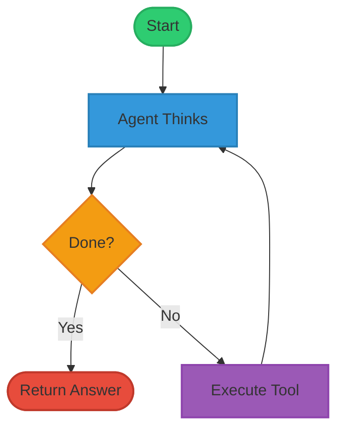

# Agent Service

## Overview

A ReAct (Reasoning and Acting) agent that iteratively thinks and acts using tools until completing tasks.

## Running the Service

### Prerequisites

Start the required infrastructure services:

| Service | Description |
|---------|-------------|
| `redpanda` | Message broker for Kafka communication |
| `llm` | LLM inference service |
| `image-generator` | Image generation service (FLUX.1-Kontext) |
| `riva` | NVIDIA Riva ASR service |

These can be started via Docker Compose from the repository root.

### Starting the Service

```bash
uv run agent-service/src/main.py
```

## Set Up

In the compose.yaml file, set the `EXTERNAL_MINIO_BASE_URL` environment variable to your `YOUR_IP:9010`, if running minio locally.

## Tracing

View traces at [http://localhost:6006/](http://localhost:6006/) (Phoenix).

## Development Scripts

The following scripts are available for development and testing:

### Prerequisites

Install all dependencies:

```bash
uv sync --all-packages
```

### Mock User (`mock_user.py`)

Simulates user interactions with the agent for testing conversations. Connects to Kafka to send user utterances and receive agent responses.

```bash
# Interactive mode - type messages to converse with the agent
uv run agent-service/scripts/mock_user.py interactive

# Listen-only mode - monitor agent output without sending messages
uv run agent-service/scripts/mock_user.py listen
```

### Trigger Agent Restart (`trigger_agent_restart.py`)

Sends a Kafka message to restart the agent service. Useful for resetting agent state during development.

```bash
uv run agent-service/scripts/trigger_agent_restart.py
```

## How It Works

The agent follows a simple loop:



**Process:**
1. **Agent Node:** LLM decides next action (`thought`, `tool`, `tool_input`)
2. **Tool Node:** Executes tool and publishes status events (`TOOL_CALL_STARTED`, `TOOL_CALL_COMPLETED`/`FAILED`)
3. **Repeat** until task complete

**State:**
- `messages` (persistent): Full conversation history
- `agent_scratchpad` (ephemeral): Current action, cleared after each tool call

## Key Features

- **Auto-summarization:** Trims conversation history every N turns to stay within context limits
- **Error recovery:** Configurable retries for parsing and tool execution failures
- **Real-time monitoring:** Kafka events for tool execution tracking

## Configuration

Key parameters to tune in `PhotoBoothReactWorkflowConfig`:

| Parameter | Default | Description |
|-----------|---------|-------------|
| `allow_null_tool` | `True` | Allow the agent to finish, otherwise the agent will keep trying to execute tools until the max number of tool calls is reached |
| `human_feedback_tool` | `ask_human` | Tool name to use if the tool call is null and null tool is not allowed |
| `max_history` | `15` | Max messages after summarization |
| `summarize_every_n_turns` | `5` | Summarize history every N iterations |
| `max_tool_calls` | `15` | Maximum iterations before stopping |
| `parse_agent_response_max_retries` | `1` | Retries for parsing errors |
| `tool_call_max_retries` | `1` | Retries for tool errors |

For more information and other parameters, refer to the [Photo Booth React Workflow Config](workflows/photo_booth_agent/src/photo_booth_agent/react_function.py).

## Tools

Agent tools are defined in [workflows/photo_booth_agent/src/photo_booth_agent/tools/](workflows/photo_booth_agent/src/photo_booth_agent/tools/). Each agent configuration specifies which tools are available to that agent.

## Available Agents

You can add your own agent configuration files to the [src/configs](src/configs) directory.
To switch between agents, edit the `agent_config` parameter in the [compose.yaml](compose.yaml) file to the desired agent configuration file. All configuration files are located in the [src/configs](src/configs) directory.

```yaml
agent:
  ...
  configs:
    - source: config_agent
      target: /config.yaml

configs:
  config_agent:
    content: |
      agent_config: <agent_configuration_file>.yml
```

### Photo Booth Assistant
Spark & Reachy Photo Booth comes with a default agent configuration file for a photo booth assistant.

**Configuration:** [photobooth.yml](src/configs/photobooth.yml)
