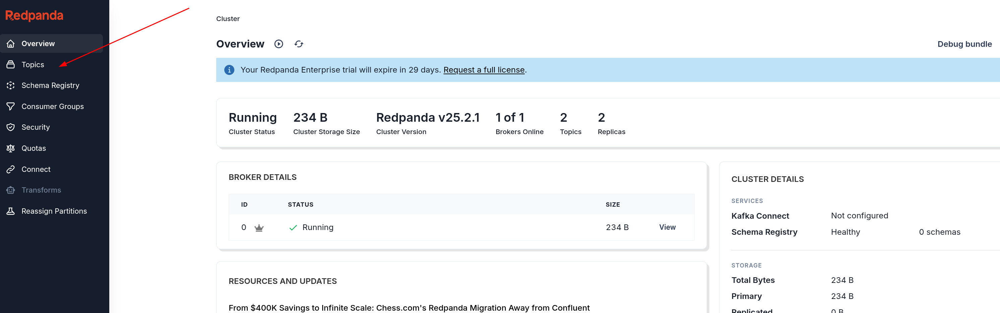
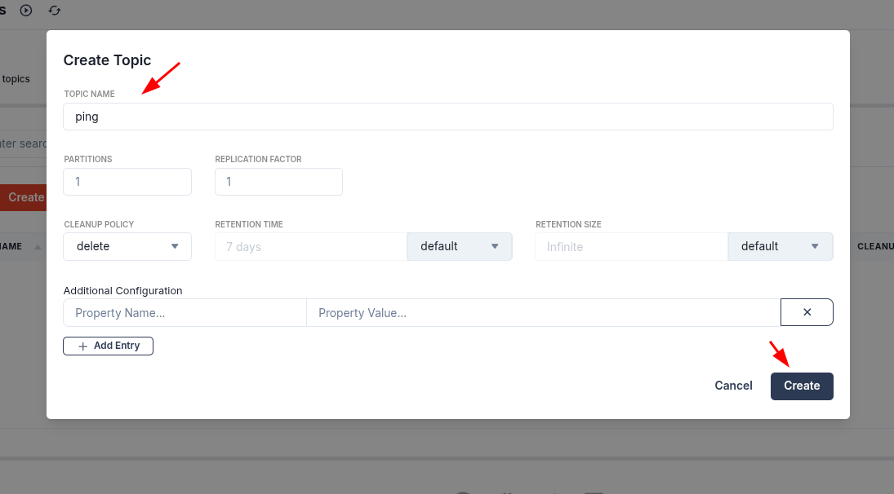
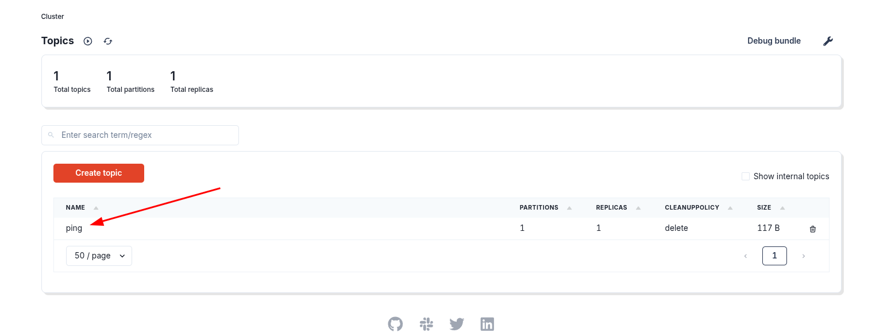
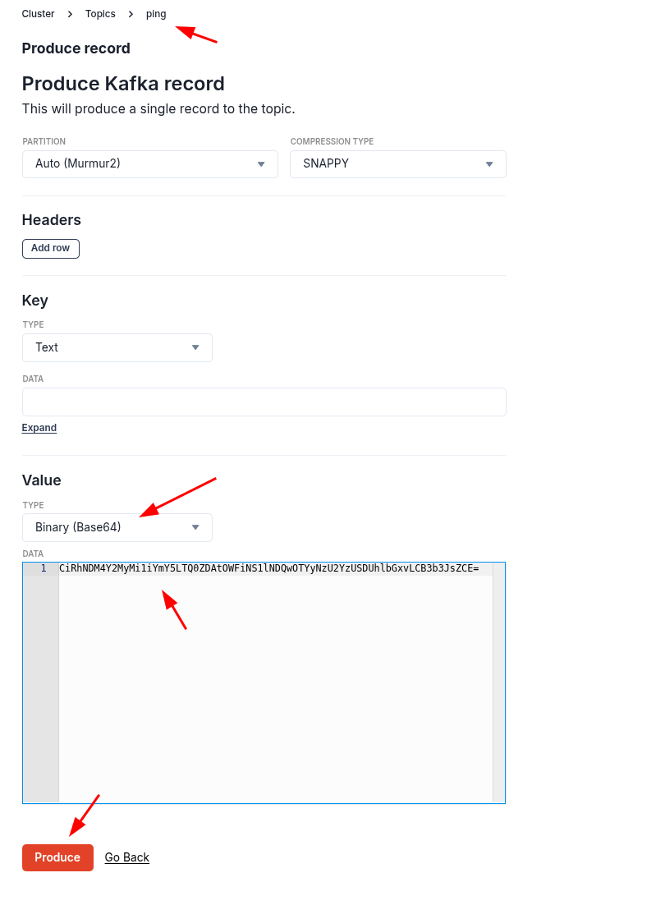

# Writing Your First Service

This tutorial walks through creating a new service using the provided template. In this example, the service will be named `my-service`.

## Create a New Service from the Template

Run the following commands in the repository root to scaffold a new service named `my-service`:

```shell
NAME=<my-service>
uv init $NAME --bare && uv lock
cp -r template/* $NAME
find $NAME -type f -exec sed -i "s/SERVICE_NAME/$NAME/g" {} \;
uv add --package $NAME workmesh pydantic
uv sync --all-packages
```

These commands will:

- Initialize a new Python project using UV
- Copy the service template into a new directory named `my-service`
- Replace placeholders with your service name

## Register the Service in Docker Compose

Add the service compose file to the root `docker-compose.yaml` includes list:

```yaml
includes:
  - my-service/compose.yaml
```

This registers your new service with the development environment so it is built and started with the rest of the services.

Feel free to modify the file `compose.yaml` to add new env variables, bind new ports, add volumes etc ...

## Start the Development Environment

Start the full development environment with hot-reload enabled:

```shell
docker compose up --build --watch
```

This builds all container images (including `my-service`), launches the message broker and observability stack, and starts your service with automatic reload on code changes.

## Implement a Minimal Service

Replace the contents of `my-service/src/main.py` with the following. This defines a simple class inheriting from
`Service` and starts it using `ServiceExecutor`:

```python
import asyncio
from workmesh import Service
from workmesh.service_executor import ServiceExecutor


class MyService(Service):
    pass


async def main() -> None:
    await ServiceExecutor([MyService()]).run()


if __name__ == "__main__":
    asyncio.run(main())
```

This minimal implementation verifies the service lifecycle without introducing topics or message handling yet. In the
next step, you will add subscriptions and message production to integrate with the event-driven system.

## Consume a Ping from the ping topic

Update `my-service/src/main.py` to subscribe to the `ping` topic and handle incoming `Ping` messages:

```python
import asyncio
from workmesh import Service, ping_topic, Ping
from workmesh.service_executor import ServiceExecutor
from workmesh.service import subscribe


class MyService(Service):
    @subscribe(ping_topic)
    async def on_ping(self, message: Ping) -> None:
        print(f"Received Ping: id={message.ping_id!s}, content={message.content!s}")


async def main() -> None:
    await ServiceExecutor([MyService()]).run()


if __name__ == "__main__":
    asyncio.run(main())
```

### Create the topic in Redpanda Console

Use the Redpanda Console to create the topic named `ping`.

First, navigate to the Redpanda Console home page and click on the Topics section:



Then click the "Create topic" button:


In the create topic dialog, enter "ping" as the topic name and configure the settings:



### Publish a Ping message

Publish a `Ping` message to the `ping` topic using the Redpanda Console.
Navigate to the Topics section and select the "ping" topic you created:



Click the "Produce message" button to open the message production dialog:


In the produce message dialog, send a base64-encoded Protobuf payload (Workmesh expects raw Protobuf bytes on the
value):

- Leave Key empty
- Headers: none
- Value format: Base64 (toggle enabled)
- Value: paste the following base64-encoded Ping message

```text
CiRhNDM4Y2MyMi1iYmY5LTQ0ZDAtOWFiNS1lNDQwOTYyNzU2YzUSDUhlbGxvLCB3b3JsZCE=
```



This base64 value represents a valid `Ping` Protobuf message containing a UUID `ping_id` and `content` "Hello, world!".
Workmesh will decode the bytes on the consumer side and invoke your `on_ping` handler with the parsed `Ping` object.

Note: `Ping` is a Protocol Buffers message. Producing messages from another service ensures proper serialization. When
using the Console, providing the value as base64 ensures the exact Protobuf bytes are sent to Kafka.

### How it works

- The `@subscribe(ping_topic)` annotation marks `on_ping` as a subscriber for the `ping` topic. On service
  initialization, the base `Service` scans methods for this marker and registers the bound method as a callback for the
  topic.
- `ping_topic` is a typed topic definition exported by `workmesh`. It carries both the Kafka topic name (`"ping"`) and
  the expected message type (`Ping`). Importing it guarantees your subscription uses the correct topic identifier and
  enables type-safe deserialization of incoming messages.
- Serialization is handled by Workmesh using Protocol Buffers:
  - When publishing, messages are encoded with `SerializeToString()` and sent to Kafka with the topic name provided by
    the `Topic` object.
  - When consuming, bytes are parsed back with `ParseFromString(...)` into the protobuf message class defined by the
    `Topic` (here, `Ping`). The framework then invokes your async handler with the parsed message.
- `ServiceExecutor` starts the consumer loop and manages shutdown signals, so your `on_ping` handler is called whenever
  a new `Ping` record arrives on the `ping` topic.
