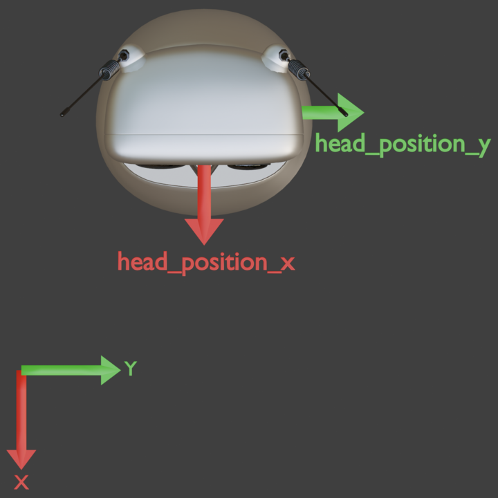

# Interaction Manager Service

## Overview

The Interaction Manager coordinates the robot's state and conversation flow, ensuring seamless, event-driven interaction between the user, robot, and AI agent.

## Running the Service

### Prerequisites

Start the required infrastructure services:

| Service | Description |
|---------|-------------|
| `redpanda` | Message broker for Kafka communication |
| `robot-controller` | Robot hardware control service |
| `agent` | LLM-powered agent service |

These can be started via Docker Compose from the repository root.

### Starting the Service

```bash
uv run interaction-manager-service/src/main.py
```

## Configuration

The default configuration lets you run the interaction manager out of the box. To customize settings, edit the relevant fields in [compose.yaml](compose.yaml).

The most commonly adjusted options are:

```yaml
configs:
  config_interaction_manager:
    content: |
      robot_utterances_path: /app/data/robot_utterances.yaml
      robot_config:
        photo_booth_bot:
          voice_config:
            pitch_shift: <e.g. -0.1>
            word_speed_range: <e.g. 0.6>
            skip_chance: <e.g. 0.1>
          animation_config:
            find_angle_step: <e.g. 45.0>
            find_range: <e.g. 180.0>
          light_config:
            focus_duration: <e.g. 50.0>
          center_user_timeout: <e.g. 10.0>
          enable_listening_while_speaking: <true|false>
      tool_names:
        start:
          - <tools_that_start_interaction>
        human:
          - <tools_that_require_human_input>
        image_generation:
          - <tools_that_generate_images>
        taking_picture:
          - <tools_that_take_pictures>
        end:
          - <tools_that_end_interaction>
      room_mapping:
        screen: <e.g. {x: -1.5, y: -1.2}>
      global_clip_volume: <e.g. 1.0>
      time_between_comments:
        min: <e.g. 1.5>
        max: <e.g. 3.0>
```

To learn more about all available configurations, refer to the [Interaction Manager configuration](src/configuration.py).

## Robot Utterances

The robot's spoken phrases are defined in [data/robot_utterances.yaml](data/robot_utterances.yaml). You can customize what the robot says during different events:

- `wake_up` – Phrases when the robot wakes up
- `look_at_human` – Phrases when taking a picture (`started` and `completed`)
- `generate_image` – Phrases when image generation completes
- `qr_code_preparation` – Phrases when preparing to show a QR code
- `demo_information` – Fun facts about the demo (`performance` and `facts`)

## Room Mapping

The `room_mapping` configuration tells the robot where objects are located so it can look at them. The robot is at the origin `(0, 0)`.

**Coordinate conventions:**
- **X**: positive direction = the front (viewed from the robot) pointing towards the user
- **Y**: positive direction = left side (viewed from the robot)
- Only direction matters (not distance), so `(1, 1)` and `(2, 2)` point the same way

Configure positions in the `room_mapping` section of [compose.yaml](compose.yaml):

```yaml
room_mapping:
  screen: {x: -1.5, y: -1.2}
```


