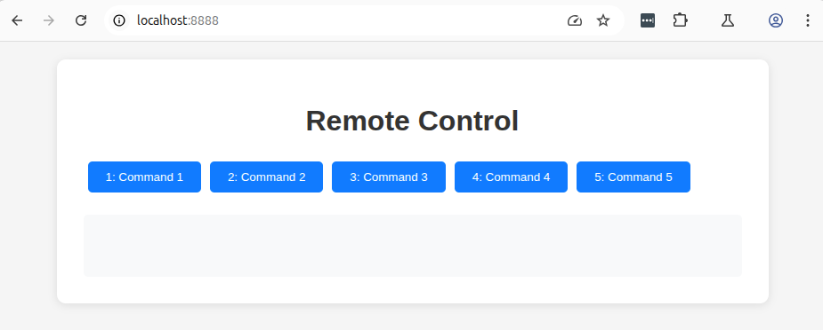

# Remote Control Service

## Overview

A service to trigger remote control command messaging through a web UI.

## Running the Service

### Prerequisites

Start the required infrastructure services:

| Service | Description |
|---------|-------------|
| `redpanda` | Message broker for Kafka communication |

These can be started via Docker Compose from the repository root.

### Starting the Service

```bash
uv run remote-control-service/src/main.py
```

The available commands can be customized in the service configuration.

The service sends out a message on the `remote_control_command_topic` that carries a `RemoteControlCommand` payload including the command name.

Once the service has started, the UI is accessible at http://localhost:8888.


